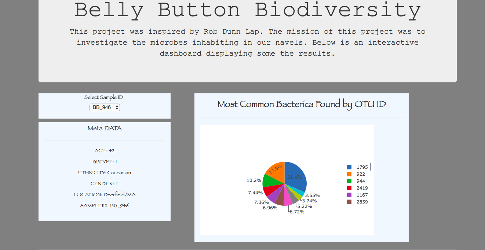
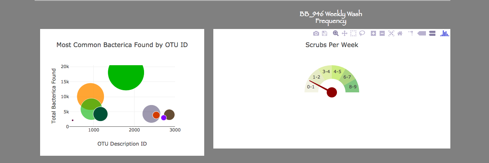

# Belly Button Biodiversity

The objective for this project was to build an interactive web application to explore the [Belly Button Biodiversity DataSet](http://robdunnlab.com/projects/belly-button-biodiversity/) and deploy on Heroku.

here is the link to the app https://belly-button-diversity.herokuapp.com

## Tool Used:
<ul>
  <li>Python</li>
  <li>Pandas 0.20.1</li>
  <li>Flask 0.12.2</li>
  <li>HTML5 AND CSS5</li>
  <li>Heroku</li>
</ul>

## Results

  
  

