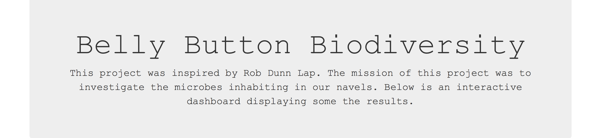
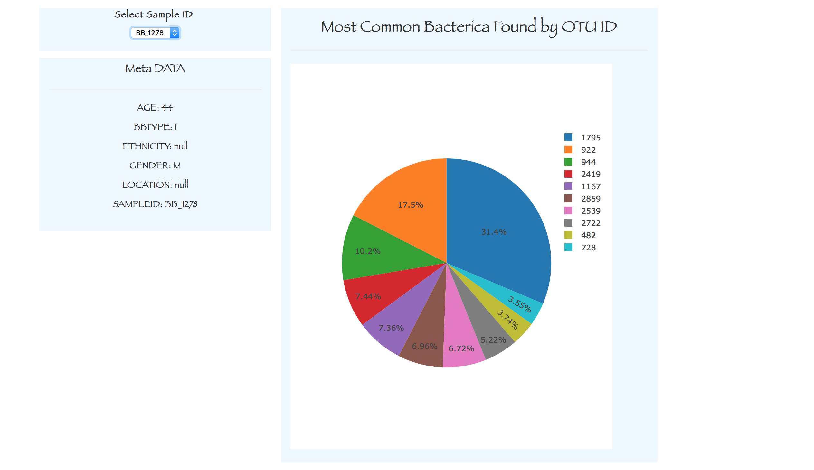
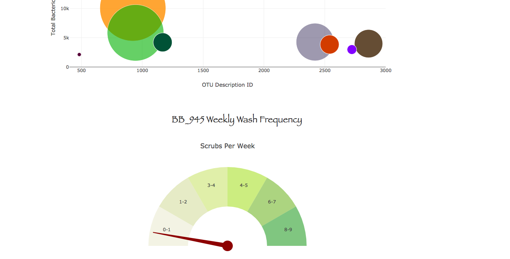

# Belly Button Biodiversity

The objective wa to learn how to make an interactive dashboard to explore the [Belly Button Biodiversity DataSet](http://robdunnlab.com/projects/belly-button-biodiversity/).

##Tool Used:

##Results

  
  
  

